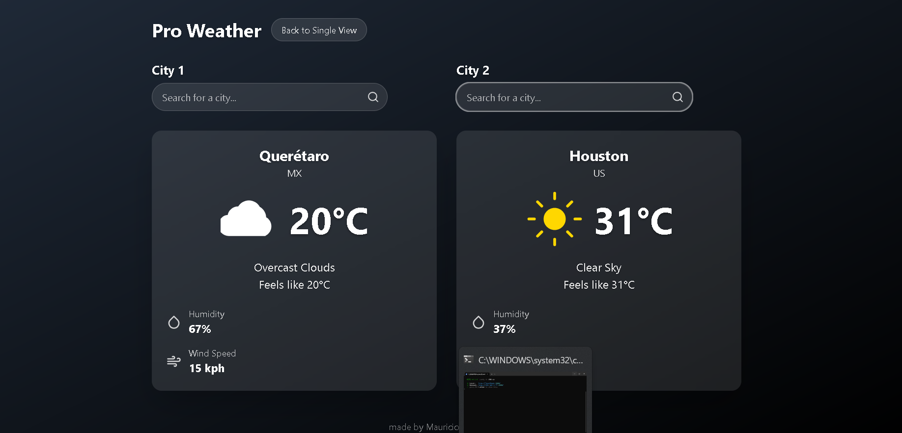

# Pro Weather App

A modern weather application built with React and TypeScript, powered by Vite. This app allows users to view current weather conditions and a forecast for a specified city, with a dynamic background that changes based on the time of day. It also features a comparison view to compare weather across different locations.


## Features

- **Current Weather Display:** Shows real-time weather information for a selected city.
- **Weather Forecast:** Provides a detailed forecast.
- **City Search:** Easily search for weather in any city.
- **Dynamic Backgrounds:** Visual themes that adapt to the time of day (morning, afternoon, evening, night).
- **Compare View:** Compare weather conditions between multiple cities.
- **Responsive Design:** Optimized for various screen sizes.

## Technologies Used

- **React:** A JavaScript library for building user interfaces.
- **TypeScript:** A typed superset of JavaScript that compiles to plain JavaScript.
- **Vite:** A fast build tool that provides a lightning-fast development experience.
- **Tailwind CSS:** (Inferred from class names like `min-h-screen`, `bg-gradient-to-br`, etc. in `App.tsx`)

## Installation

To get a local copy up and running, follow these simple steps.

### Prerequisites

Make sure you have npm installed.

- npm
  ```sh
  npm install npm@latest -g
  ```

### Clone the repository

```sh
git clone <repository_url>
cd pro-weather
```

### Install dependencies

```sh
npm install
```

## Usage

To start the development server:

```sh
npm run dev
```

Open your browser and navigate to `http://localhost:3000`.

## Project Structure

```
.env.local
.gitignore
App.tsx
README.md
components/
├── CompareView.tsx
├── ComparisonCard.tsx
├── CurrentWeather.tsx
├── Forecast.tsx
├── Loader.tsx
├── SearchBar.tsx
├── WeatherIcon.tsx
└── WeatherInfo.tsx
index.html
index.tsx
metadata.json
package.json
services/
└── weatherService.ts
tsconfig.json
types.ts
vite.config.ts
```

## Author

- Mauricio Arredondo
